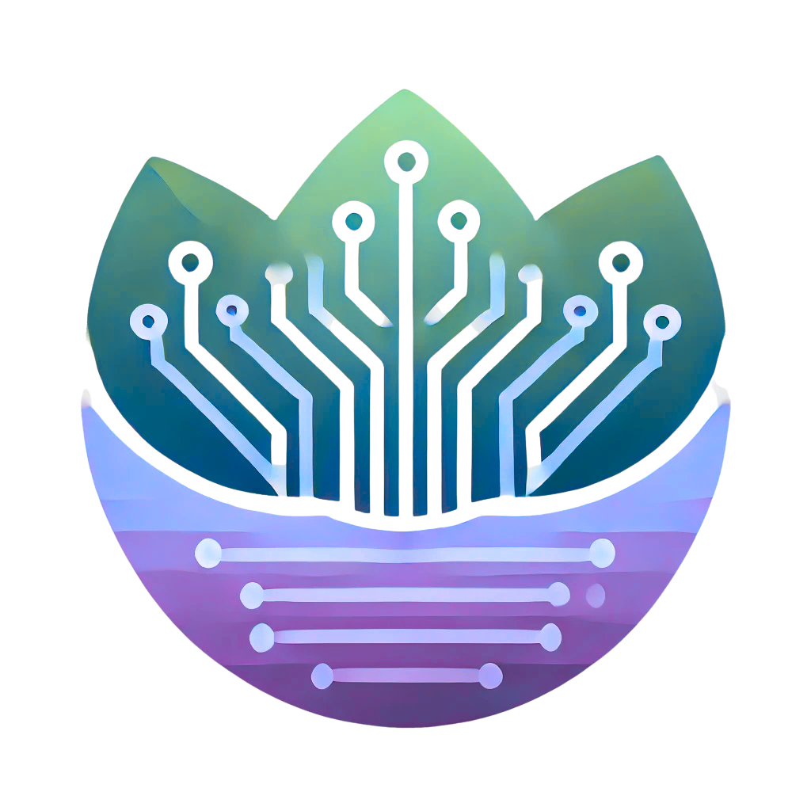

# DevWell - Wellness for Software Developers

## What is DevWell?
---

DevWell, is a cross-platform app I am working on. I have noticed that many Software Developers/Software Engineers have to deal with a lot of burn-outs/stress. That's why I decided to work on DevWell!

  

## What does DevWell offer
---

What does DevWell bring to the table (some features, I want to work on/include in the app):
- Custom reminders for short brakes
- Customized mindfulness sessions
- Daily wellness logging

> Note: More features will be added in the building process.

## Tech-stack
---

- React-Native
- Expo-framework

> Will update this later